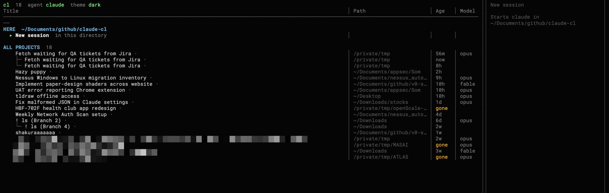
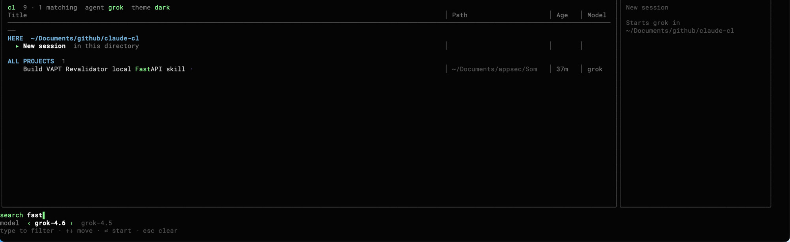

<h1 align="center">cl</h1>

<p align="center">
  <em>Pick up where you left off in Claude Code.</em>
</p>

<p align="center">
  <a href="https://github.com/kiraa06/claude-cl/actions/workflows/ci.yml"></a>
  <a href="https://github.com/kiraa06/claude-cl/releases/latest"></a>
  <a href="LICENSE"></a>
  
</p>

<p align="center">
  
</p>

`claude` always starts fresh. `cl` shows you what you were already working on —
named, grouped by where you are, and one keystroke away.

Every conversation is listed by the title the agent gave it (*"Fix flaky auth
middleware test"*, not a UUID), with the sessions from your current directory
first, then the rest of your repo, then everything else. Titles wrap instead of
clipping. Forks and clones nest under their parent. The list and preview are
bordered panes that follow the terminal size.

## Install

**Script** — macOS and Linux, no Go needed:

```sh
curl -fsSL https://raw.githubusercontent.com/kiraa06/claude-cl/main/install.sh | sh
```

Installs to `~/.local/bin`. Set `BINDIR=/usr/local/bin` to change that.

**Go**:

```sh
go install github.com/kiraa06/claude-cl/cmd/cl@latest
```

**From source**:

```sh
git clone https://github.com/kiraa06/claude-cl
cd claude-cl
go build -ldflags='-s -w' -o ~/.local/bin/cl ./cmd/cl
```

Or grab a binary from the [releases page](https://github.com/kiraa06/claude-cl/releases).

### Requirements

- At least one of [Claude Code](https://claude.com/claude-code),
  [Grok](https://x.ai/cli), or
  [Codex](https://github.com/openai/codex) on your `PATH`
- Go 1.26+ only if you build it yourself

## Use it

```sh
cl              # open the picker (Claude by default)
cl kafka        # open it filtered to "kafka"
cl --grok       # Grok sessions for this run
cl --codex      # Codex sessions for this run
```

Type `cl` where you'd normally type `claude`. The `New session` row is selected
by default, so `cl` then `⏎` is the same as running the current agent.

### Keys

| Key | |
|---|---|
| `↑` `↓` / `j` `k` | move — section headers are skipped |
| `PgUp` `PgDn` / `Ctrl+U` `Ctrl+D` | jump a screen |
| `←` `→` / `h` `l` / `Tab` | choose the model |
| `⏎` | start or resume the highlighted row |
| `f` | **fork** — resume under a new session id, leaving the original untouched |
| `y` | copy the session id |
| `d` | **delete** — moves the transcript to the trash, never erases it |
| `/` | search titles, directories, branches and models |
| `p` | toggle the preview pane |
| `t` | cycle **claude / grok / codex** — only when more than one is installed |
| `T` | theme **dark / light** |
| `g` / `G` | jump to first / last |
| `q` / `esc` | quit |

## What it does

### Groups sessions by how close they are to you

- **HERE** — sessions from the directory you ran `cl` in. Holds `New session`.
- **REPO** — the rest of the current git repository, including its worktrees.
  Skipped when you aren't in a repo.
- **ALL PROJECTS** — everywhere else, newest first.
- Forks nest under the session they were forked from, so a continuation sits
  as a child of the original chat rather than a duplicate at the same indent.
  Claude's own clones (the `⑂` branches) nest the same way. A name you set
  in Claude wins over the generated title.

### Names conversations properly

Claude titles most sessions itself, and those are marked with a `·`. For the
rest, `cl` uses the opening prompt — skipping over "ok" and "hey" to find the
prompt that actually says something, and preferring plain English to a pasted
stack trace. Scheduled runs are titled by their task name.

### Remembers which model a conversation was using

The footer follows the highlighted row, so resuming a Sonnet conversation
resumes it on Sonnet. `New session` uses the `model` from your
`~/.claude/settings.json`. Press `←` `→` to override, and it stays put.

### Other tools

If `grok` or `codex` is on your PATH as well, press `t` to cycle
**claude / grok / codex**. The current agent is labelled in the list pane
(`agent grok`). The switcher is omitted when only one of those CLIs is
installed. Default is Claude; the last choice is remembered in
`~/.config/cl/tool`. You can also pass `--grok` or `--codex` for one run.

`T` switches **dark / light**. Dark is the original foreground-only palette.
Light paints a white canvas (including every cell) so it stays readable on a
dark terminal. The choice is stored in `~/.config/cl/theme`.

### Finds things

<p align="center">
  
</p>

Search covers titles, directories, branches and models. Every term has to
match, so terms narrow the list like they do in a shell.

### Deletes safely

`d` asks first, then *moves* the transcript to `.<agent>/.trash-cl/<date>/`
(under `~/.claude`, `~/.grok`, or `~/.codex`) along with its subagent logs.
Nothing is unlinked — these files hold hours of conversation and can run to
tens of megabytes.

## It's fast

Transcripts get big: on the machine this was built on, 149 sessions came to
277MB, the largest single file 63MB. Reading all of that to draw a list would
take a quarter of a second, so `cl` doesn't. It reads a 64KB window at each end
of every transcript and screens lines with a byte scan before parsing any JSON.

**The whole store is read in about 40ms**, with no cache to fall out of date.

## Troubleshooting

**`cl: claude, grok, or codex not found on PATH`** — `cl` launches one of
those agents. Install at least one and check with `which claude` (or `grok` /
`codex`).

**macOS says `killed: 9` when you run `cl`.** Gatekeeper rejects Go's
linker-signed binaries once they have been downloaded. The install script
re-signs it for you; if you unpacked a release by hand, do the same:

```sh
xattr -c ./cl && codesign --force --sign - ./cl
```

Installing with `go install` avoids this entirely, since the binary is compiled
on your own machine.

**`command not found: cl` after installing** — `~/.local/bin` isn't on your
`PATH`:

```sh
echo 'export PATH="$HOME/.local/bin:$PATH"' >> ~/.zshrc && exec zsh
```

**A session I remember isn't listed.** `cl` hides sessions with no human turn
and sessions whose working directory can't be resolved, because neither can be
resumed. It also caps ALL PROJECTS — press `/` to search the rest.

**The preview pane is missing.** It hides itself below ~104 columns. Widen the
window, or press `p`.

**Resuming moved me to another directory.** By design. Claude Code can find a
session from anywhere, but running it elsewhere would use the wrong
`CLAUDE.md`, the wrong relative paths and the wrong repo — so `cl` returns you
to the directory the conversation was happening in.

## Uninstall

```sh
rm ~/.local/bin/cl
```

`cl` remembers the last agent and theme in `~/.config/cl/` (`tool`, `theme`).
It never modifies your sessions, except when you press `d`.

## Contributing

Issues and pull requests are welcome — see [CONTRIBUTING.md](CONTRIBUTING.md).
The design and the measurements behind it are written up in
[`docs/DESIGN.md`](docs/DESIGN.md).

## License

[MIT](LICENSE)
